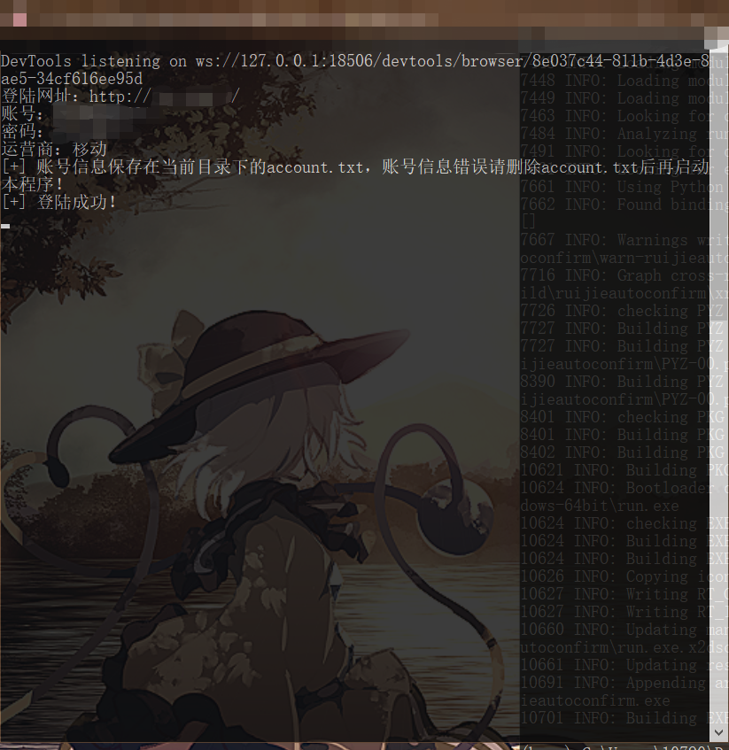

# RG-SAM-Portal_Auto_Login

## 锐捷校园网自动登陆脚本

## 目录

	|--autoconfirm		打包好的程序
	|--source			python脚本源码

## 前言
学校里用的是锐捷的校园网认证系统，因为每次联网都要在浏览器登陆，很不方便，因此写了这个脚本

## 详情
这个是python3脚本，使用selenium模块来模拟登陆的行为过程，原本是用requests的，但是一直报设备无法认证的错误，因此改用了selenium（不得不说selenium是真的好用）。为了方便使用，我用pyinstaller打包成exe程序。

## 使用
初次打开程序需要输入登陆网址，账号，密码和运营商，这些信息目前是会明文保存在程序的目录下，之后再打开程序就直接读取信息自动登陆。

具体如下图：

登陆成功即可关闭命令行窗口（暂时没办法关掉）

登陆失败也会有相应的提示。

如果账号信息需要修改，删除account.txt再打开程序即可。

附带的chromedriver是85.0.4183.87版本的，支持85版本的Chrome浏览器，如果版本不同，可以到[这里下载](https://sites.google.com/a/chromium.org/chromedriver/downloads)

## 不足

* 因为是初学selenium，目前做出Chrome浏览器的模拟登陆，后续有空会更新通用的浏览器模拟登陆。

* 因为没钱买MAC，只能整个exe程序了。（=￣ω￣=）